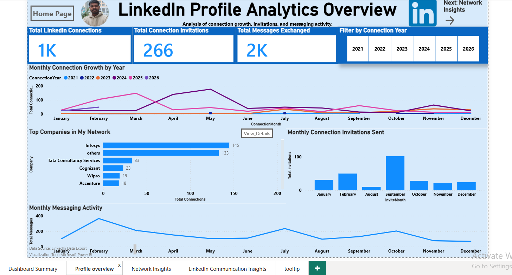
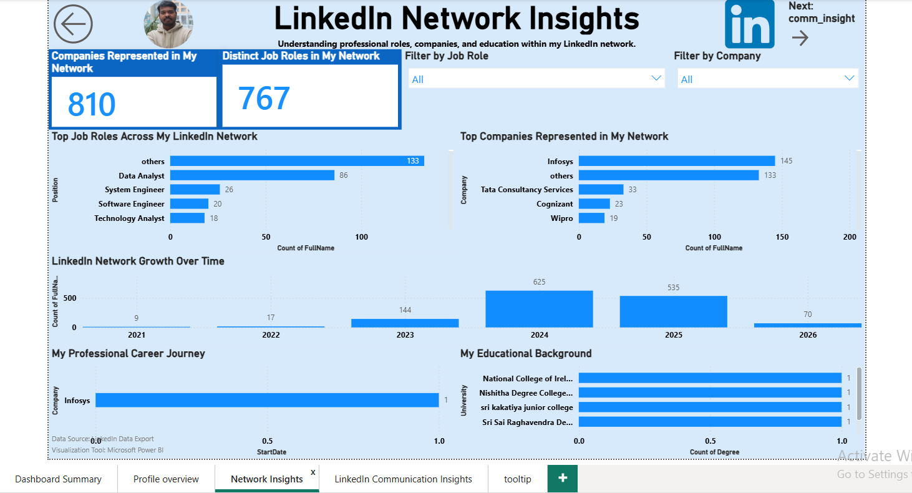
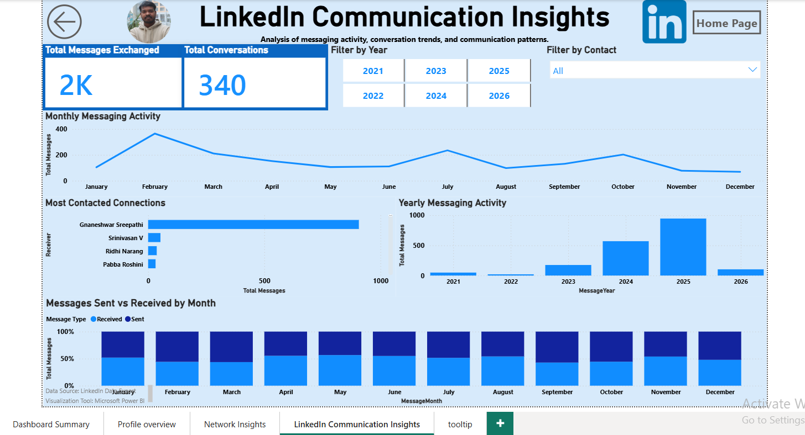

#  LinkedIn Network Analytics Dashboard (Power BI)

##  Project Overview

This project analyzes LinkedIn exported data to understand professional networking trends, communication patterns, and network composition using Power BI.

---

##  Dashboard Pages

1. Dashboard Summary (Landing Page)
2. Profile Analytics Overview
3. Network Insights
4. Communication Insights

---

##  Key Features

* Network growth analysis
* Company & job role insights
* Messaging activity trends
* Most contacted connections

---

##  Advanced Features

* Bookmark navigation (Chart Focus)
* Drill-down functionality
* Custom tooltips
* Report page tooltips
* Interactive slicers

---

##  Screenshots

### Dashboard Summary

### Profile Overview

### Network Insights

### Communication Insights

---

##  Documentation

📄 Full documentation available in:
`documentation/project_documentation.pdf`

---

##  Tools Used

* Microsoft Power BI
* Power Query
* DAX

---

##  Data Source

LinkedIn Data Export
